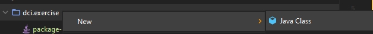
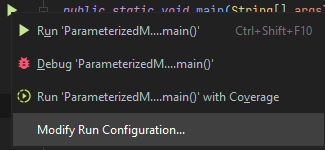
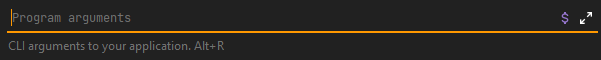

# Hello World and comments in Java

## Our exercise:

In this exercise, we will focus on the `main` method of a Java class - we'll be creating different
entry points to run our code, meaning we'll have multiple `main` methods in different classes.

We'll use a parameterless `main` method as well as one with parameters.

We will also focus on the usage of the `System.out.print()` and `System.out.println()` methods to
print different data types.

Finally, we will focus on different types of comments available in Java:

- Block comments
- Inline comments
- Documentation strings

---

## Task 1

In this task we'll create a parameterless main method and print different data types.

### Step 1

Create a class called `Main.java` inside the `dci.exercise` package. There's a file in there
called `package-info.java` explaining that it's there where our exercises should be.

#### Step 1.1: Create the Main class

To create a new class using the IDE, you can simply right-click on the desired package, then
**New > Java Class**.



#### Step 1.2: Create the main method

Now you should create the main method. It should be written in a specific way to be recognized as
the entry point by the JVM. Make sure to write it right.

> **Hint**: the `psvm` is a code snippet that will create a main method template for you. Since
> you're learning, try to write it manually first.

#### Step 1.3: Write Hello World!

Using the `println` method from the `System.out`, print `Hello World!` on the console!

> **Hint:** Remember, you can run your Java program straight from the IDE, by clicking the green
> arrow either next to the class' name or to the main's method name.

### Step 2

Your task now is to print different values on the console. Make sure to print at least one of each
of the following types:

- `int`: any integer number
- `long`: any long number. They are represented by having a `L` after the number. Ex: `14L`
- `float`: any float number. They are represented by having a `f` after the precision value.
  Ex: `1.14f`
- `double`: any double number. They are represented by having a `d` after the precision value
  (optional - if you have precision, it's automatically considered a double). Ex: `2.32`
- `boolean`: any boolean value. `true` or `false`.
- `String`: any text value.

Use the `print()` method to print information about the upcoming information. Use the `println()`
method to print the actual information.

```java
System.out.print("Integer value: ");
    System.out.println(intValue);
```

Your console should have an output similar to this:

```bash
Integer value: 234
Long value: 321
Float value: 34.3
Double value: 78.93
Boolean value: true
String value: Hello!
```

## Task 2

In this task we'll create a parameterized main method.

### Step 1

Create a class called `ParameterizedMain.java` inside the `dci.exercise` package. Follow the same
instructions as given on the previous task to achieve it.

### Step 2

Using the `println()` method, print out on the console **3 to 5** values captured from the `args`
array.

### Step 3

While using the IDE, set the parameters before running your code. You can achieve that by
right-clicking the green arrow next to the class' or the method's name and going to **Modify Run
Configuration... > Program arguments**.





## Task 3

Time to use comments in your code.

Go back to both classes you created, and put some comments in your code.

### Step 1

Go back on the `Main` class.

### Step 1.1

Add a **single line comment** before each `println` to tell what is about to be printed.

```java
//printing an integer
```

### Step 1.2

Add a **documentation comment** for both the `main` method and for the class itself, explaining what
they are doing.

```java
/**
 * This is our main class.
 * It holds a parameterless main method.
 */
public class Main {

}
```

> Hint: Remember, you can simply type `/**` and press `Enter`  before a method or class to create a
> javadoc template for you.

### Step 2

Go back on the `ParameterizedMain` class.

### Step 1.1

Add a **multi line comment** inside the `main` method, before the `println`'s to tell what those
lines are about.

### Step 1.2

Add a **documentation comment** for both the `main` method and for the class itself, explaining what
they are doing.